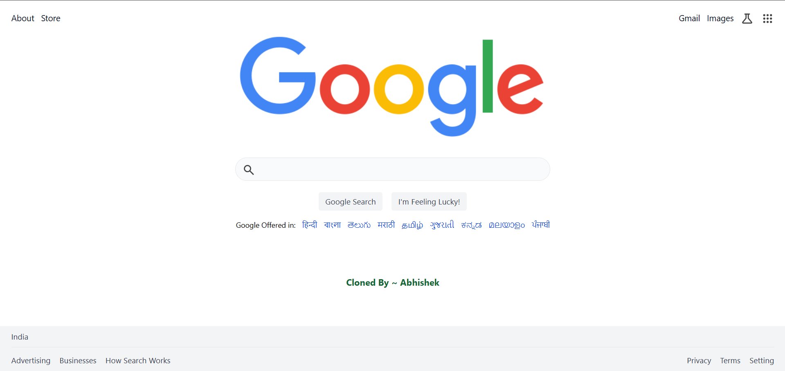

# 🔍 Google Search Bar Clone (Tailwind CSS via CDN)

A clean, minimal, and responsive Google search bar clone built using **Tailwind CSS (CDN)**. Great for practicing frontend layout and design with zero build tools.

---

## 📸 Screenshot



---

## 🚀 Features

- ✅ Google-style search bar interface
- ⚡ Built using Tailwind CSS via CDN — no setup needed
- 🌐 Fully responsive layout
- 🎨 Utility-first CSS styling
- 🧩 Simple HTML structure — easy to modify

---

## 💡 Usage

1. Download or clone this repo.
2. Open `index.html` in your browser.
3. You’ll see a clean Google-like search bar styled with Tailwind.

> You can also make the search bar functional:
```html
<form action="https://www.google.com/search" method="GET">
  <input name="q" type="text" placeholder="Search Google..." />
</form>
````

---

## 📝 License

This project is open-source and available under the **MIT License**.

```

Let me know if you'd like help deploying it or turning it into a React/Vue component too.
Thank Your ~ abh0x1
```
